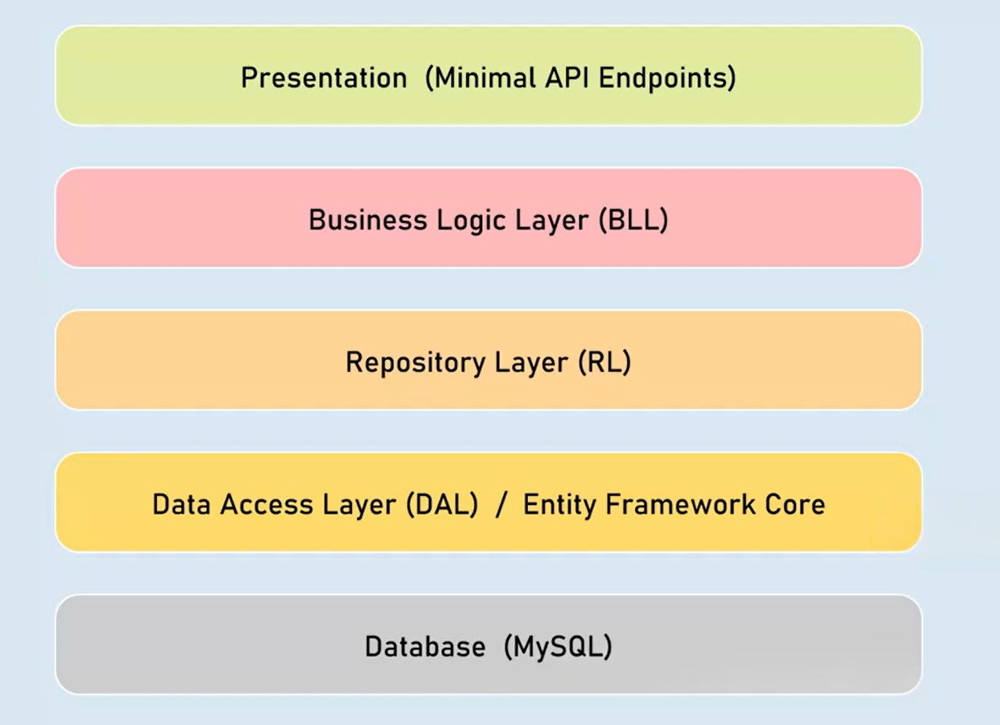
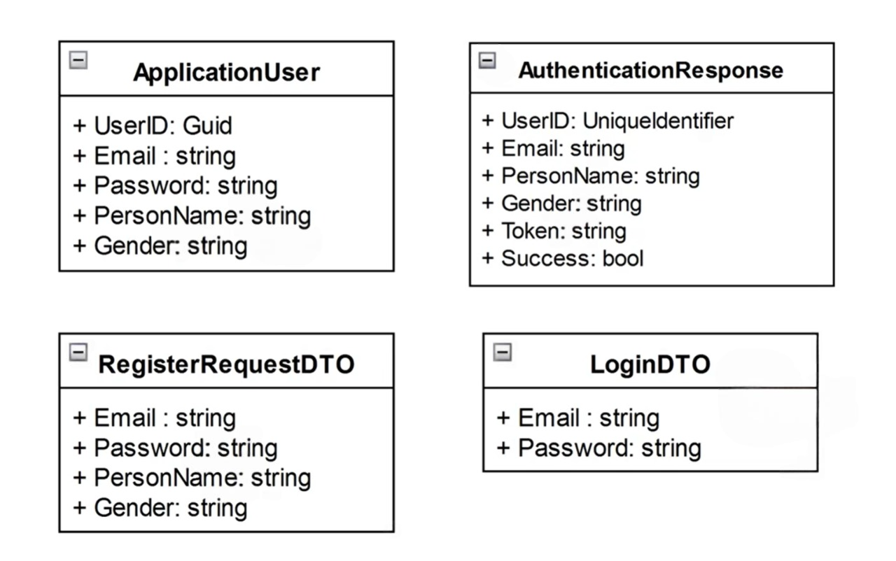
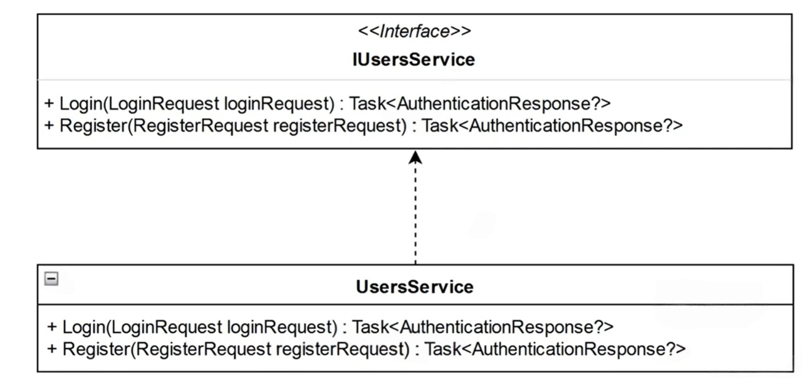
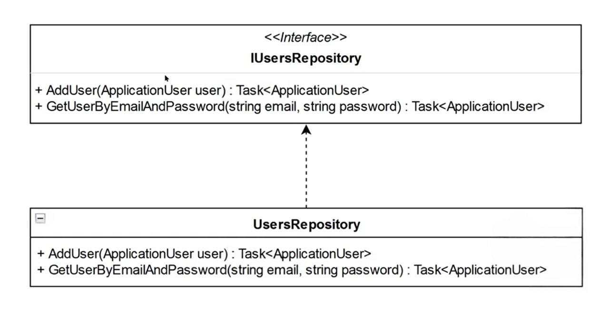

# Architecture

## Core
### Entities
#### User Models

### Services
#### User Service

## Infrastructrue
> what is the difference between Repository and Services?
- Repository is related to databse operations, like CRUD
- Service should be desgined based on Usecases
  
### Repository
#### User Repository

